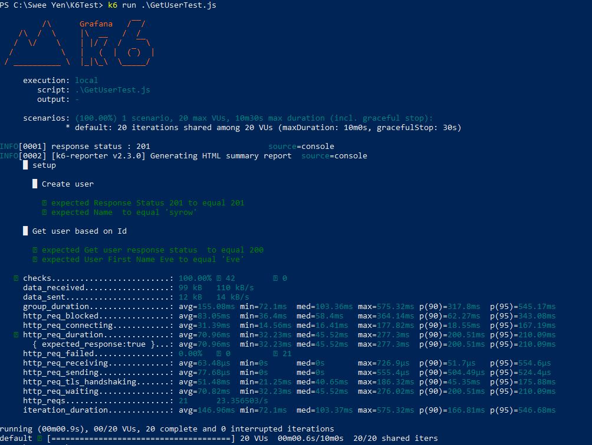

# K6

Grafana k6 is an open-source load testing tool that makes performance testing easy and productive for engineering teams. k6 is free, developer-centric, and extensible.

## Installation

Execute command below in powershell.

```winget
winget install k6 --source winget
```

## How to run the test
Locate to the folder where the test exists.
Execute the test.

```
k6 run <testscriptname>.js
```

## Check Test Result Locally

Result is stored at ``Result`` folder in html / junit format. 

## Sample Local Result



## For CI/CD Result, please refer to github workflow link below
https://github.com/sweeyen/k6-perf-test/actions